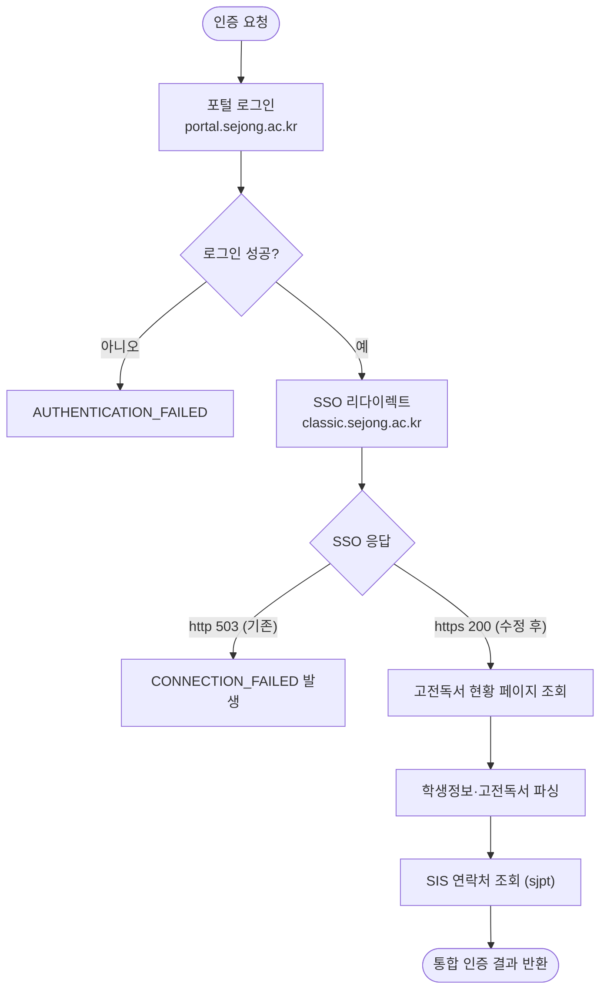

# 세종대 포털 연결 실패로 모든 인증 동작 안 함 (CONNECTION_FAILED) 해결 보고서

## 개요

세종대학교 측이 `classic.sejong.ac.kr`의 HTTP 평문(80포트) 서비스를 중단하면서, 모듈 기본 설정의 SSO 리다이렉트 URL(`http://`)이 모든 요청에서 `503 Service Unavailable`을 받아 전체 인증이 실패하던 문제를 해결했다. 포털 로그인 방식 자체는 변경되지 않았으며, SSO 리다이렉트 URL 기본값을 `https://`로 변경하는 것만으로 전 기능이 정상 복구되었다. 실계정 통합 테스트(DHC·SIS·통합 인증) 전부 통과 후 v1.2.6으로 배포 완료했다.

## 원인 진단 과정

모듈과 동일한 조건(OkHttp User-Agent, 동일 폼 파라미터, 쿠키 유지)으로 인증 전 구간을 단계별 재현하여 실패 지점을 특정했다.

| 단계 | 요청 | 결과 |
|------|------|------|
| 1. 포털 로그인 | `POST portal.sejong.ac.kr/jsp/login/login_action.jsp` | ✅ 200, `result='OK'`, ssotoken 발급 — 로그인 방식 변경 없음 |
| 2. SSO 리다이렉트 (기존 `http://`) | `GET http://classic.sejong.ac.kr/_custom/sejong/sso/sso-return.jsp` | ❌ **503** — 실패 지점 |
| 2′. SSO 리다이렉트 (`https://`) | 동일 URL, 스킴만 변경 | ✅ 303 → `classic/index.do` 정상 진입 |
| 3. 고전독서 현황 페이지 | `GET https://classic.sejong.ac.kr/classic/reading/status.do` | ✅ 200, 학생정보·고전독서 데이터 정상 |
| SIS 전체 흐름 | `sjpt.sejong.ac.kr` 로그인 → SSO → `initUserInfo.do` | ✅ 200, 연락처 정보 JSON 정상 (원래 전부 https라 영향 없음) |

- `http://classic.sejong.ac.kr`은 경로와 무관하게 **모든 요청이 503** → 학교 측 HTTP 서비스 중단(https 전용 전환)으로 판단
- 페이지 HTML 구조는 변경되지 않아 기존 파서 로직은 수정 불필요

## 기능 흐름



## 변경 사항

### 설정 기본값 수정
- `src/main/java/kr/suhsaechan/sejong/auth/config/SejongAuthProperties.java`: `ssoRedirectUrl` 기본값의 스킴을 `http://` → `https://`로 변경 (classic.sejong.ac.kr HTTP 평문 서비스 중단 대응)

## 주요 구현 내용

- 수정 범위를 SSO 리다이렉트 URL 기본값 한 줄로 최소화 — 로그인·데이터 조회·파싱 로직은 검증 결과 모두 정상이므로 변경하지 않음
- `@Disabled` 처리된 실계정 연동 테스트를 임시 활성화하여 검증 완료:
  - `실제인증_DHC_고전독서정보` ✅ (학생정보·고전독서 인증 5건 파싱 확인)
  - `실제인증_SIS_연락처정보` ✅ (연락처 정보 파싱 확인)
  - `실제인증_통합_전체정보` ✅ (DHC + SIS 통합 결과 확인)
- 전체 테스트 스위트 통과 (BUILD SUCCESSFUL)

## 배포 정보

- deploy PR: [#12](https://github.com/Cassiiopeia/SUH-sejong-univ-auth/pull/12) — automerge 완료
- 릴리스 버전: **v1.2.6**

## 주의사항

- 구버전(≤ v1.2.5) 사용 중인 서비스는 라이브러리 업데이트 없이도 `application.yml`에서 아래 설정으로 즉시 복구 가능:
  ```yaml
  sejong:
    auth:
      sso-redirect-url: "https://classic.sejong.ac.kr/_custom/sejong/sso/sso-return.jsp?returnUrl=https://classic.sejong.ac.kr/classic/index.do"
  ```
- 세종대 보안장비가 일부 클라이언트 User-Agent(예: curl 기본 UA)를 차단하는 것이 확인됨. 현재 OkHttp 기본 UA는 정상 통과하나, 추후 차단 정책 변경 가능성에 대비해 브라우저 UA 설정 옵션 추가를 검토할 만함
- 학교 인프라 변경(https 전용 전환)이 재발할 수 있으므로, 연결 실패 시 http/https 스킴을 구분해 로깅하는 개선도 고려 가능
